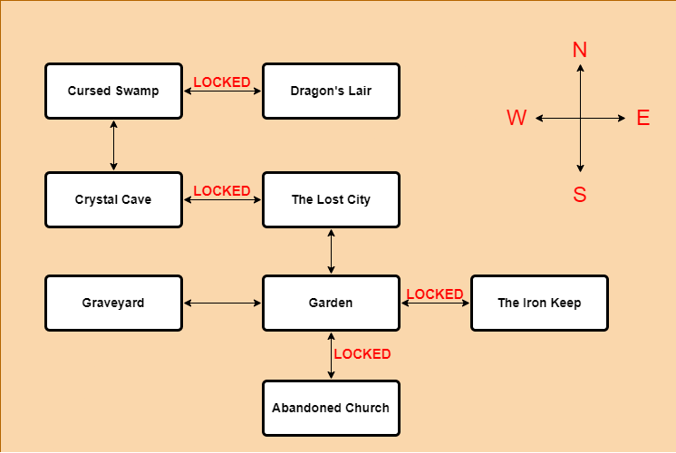

 

  <h1 align="start">ZORK</h1>

  

      License: https://github.com/UlasGuneyGenc/Zork/blob/master/LICENSE
       
      Repository: https://github.com/UlasGuneyGenc/Zork   
       
      Author: https://github.com/UlasGuneyGenc   
     
  

## Behind the scene notes

Creating this project presented a time constraint for me, as I hadn't utilized C++ in a project since my university days.
However, it was a valuable learning experience as I applied object-oriented principles. 
I also discovered that the use of C++ allowed for more efficient and faster performance in the game. While the codebase may not be optimal,
it was a positive experience overall. In addition to the technical aspects, I found developing a text adventure game to be more enjoyable than I had anticipated.
It challenged my imagination to bring the game to life through words. The process of creating a text-based game also presented an opportunity to explore different
narrative and interactive storytelling techniques. Furthermore, creating this project also gave me the opportunity to improve my problem-solving skills and work
under tight deadlines. The game development process is iterative, which means that there were many challenges that came up along the way. I had to find creative
solutions to overcome them. The ability to think on my feet and come up with quick solutions was an important skill that I developed during the project.
Moreover, the process of testing and debugging the game helped me to improve my attention to detail. I learned to spot and fix errors more efficiently.
Overall, this project was a great learning experience, not only in terms of programming skills but also in terms of project management, keeping up with the deadline
and creativity.

## About The Game
In this game, you play as a warrior who has forgotten his past.
Your goal is to defeat the final boss to complete the game.   
The game features a classic RPG stat system:  
* Health 
* Attack
* Defence

To provide more gameplay variety for players, the game features a buff system. Players can absorb the powers of four elements: fire, air, water, and earth.

* Fire  Buff:   -10 Health / 20 Attack / -10 Defence
* Water Buff:    -5 Health / 10 Attack / -5 Defence
* Earth Buff:   -10 Health / -10 Attack / -10 Defence
* Air   Buff:    20 Health / -10 Attack / -10 Defence

## Game Map

### How to Play?

* exit/quit/q  
Quits the game. 

* look/info  
Gets the info about the room. 

* bag/inventory/b/i  
Shows the items in inventory. 

* stats/stat  
Shows your stats and buff type. 

* move/go + "direction"   ie: move north  
Moves the player to the directed room. 

* take/get + "itemName"   ie: take sword  
Gets the item from ground. 

* drop + "itemName"   ie: drop sword  
Drops the item to ground. 

* examine/info/look + "entity"   ie: look chest  
Obserb the entity and get detail. 

* detail + "direction"   ie: detail north  
Gives the info of exit if it is locked or not. 

* equip/eq + "itemName"   ie: eq sword  
Equips the item. 

* unequip + "itemName"   ie: eq sword  
Unequips the item. 

* attack + "npcName"   ie: attack zga  
Attacks to the enemy. 

* unlock + "direction"   ie: unlock north  
Unlocks the exit if you have the key. 

* use + "potionName"   ie: use potion  
Uses potion and replenish health. 

* take/get + "itemName" + from + "storageName   ie: take sword from chest  
Loots item from storage items.

### Win Run Example

If you follow these instructions you will beat the game!

* info backpack
* get firescroll from backpack
* get potionsmall from backpack
* eq firescroll
* attack zga
* use potionsmall
* get woodenkey
* unlock north
* move north
* info chest
* get sword from chest
* get airscroll from chest
* eq sword
* move west
* get earthscroll
* eq earthscroll
* attack kenk
* get crystalkey
* move east
* move north
* take potionmedium
* use potionmedium
* unlock west
* move west
* info satchel
* get rustykey from satchel
* get darkplate from satchel
* eq darkplate
* move east
* move south
* unlock east
* move east
* attack ates
* get lavakey
* get greatsword
* equip greatsword
* move west
* move north
* move west
* move north
* info pouch
* get waterscroll from pouch
* get potionlarge from pouch
* use potionlarge
* unlock east
* move east
* attack drake

## License

Distributed under the MIT License. See [LICENSE](https://github.com/UlasGuneyGenc/Zork/blob/main/LICENSE.md) for more information.

## Authors

* **Ulaş Güney Genç** - ** - [Ulaş Güney Genç](https://github.com/UlasGuneyGenc) - *Built ReadME Template*

